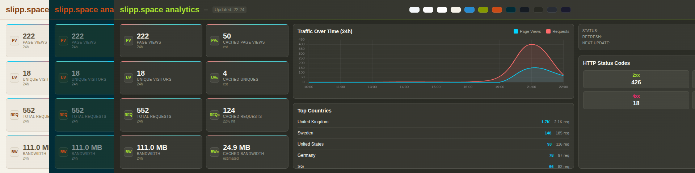

<p align="center">
  
</p>

# Cloudflare Analytics Display

Real-time analytics dashboard for Cloudflare sites, designed for horizontal sidecar displays (1920x480). Shows traffic, status codes, cache metrics, and top countries with a theme system and smooth auto-refresh.

## Features

- Traffic metrics: pageviews (with fallback), uniques, requests, bandwidth
- Live chart: last 24 hours, current hour at right edge
- HTTP status buckets: 2xx, 3xx, 4xx, 5xx totals
- Cache metrics: cached requests/bytes + estimated cached PV/UV
- Top countries: recent 3 days rollup (free-tier friendly)
- Theme system: multiple light/dark/colorful themes with quick swatches
- Single-page frontend; Node/Express backend; Docker-ready

## Requirements

Cloudflare credentials from your account:
- Zone ID: see Cloudflare docs for finding Zone ID
- API Token with `Zone:Analytics:Read` for your zone

Environment config:
- Copy `.env.example` to `.env` and fill values (at minimum `CLOUDFLARE_ZONE_ID` and `CLOUDFLARE_API_TOKEN`). Optional: `SITE_URL` for availability checks, `REFRESH_INTERVAL`, `PORT`, `DASH_VERSION`.

## Quick Start

Using Docker Compose (recommended):
```bash
cp .env.example .env
# edit .env with your Cloudflare credentials
docker-compose up -d
# open http://localhost:3001
```

Using Node.js directly:
```bash
cp .env.example .env
# edit .env with your Cloudflare credentials
npm install
npm start
# open http://localhost:3001
```

Rebuild container after changes:
```bash
docker-compose down -v
docker-compose build --no-cache
docker-compose up -d
```

## Running on a Display (Pi/desktop)

This repo includes `launch-display.sh` to launch Chromium in kiosk mode for a 1920x480 sidecar.
- Adjust flags/window geometry as needed for your setup.
- See below for service/auto-start options (systemd or shell profile).

### What `launch-display.sh` does

The script launches Chromium pointing at the dashboard and forces a full-screen, distraction-free view on your sidecar monitor.

- Sets `DISPLAY=:0` so it targets the primary X session.
- Delays briefly to allow X to initialize.
- Starts Chromium in kiosk mode with:
  - `--window-position` and `--window-size` tuned for a 1920x480 horizontal display.
  - First-run/infobar/notification/default-apps disabled.
- Sends an extra `F11` toggle to ensure fullscreen if kiosk doesn’t latch immediately.

Script location: `./launch-display.sh`

Run it manually:
```bash
bash launch-display.sh
```

### Positioning the window on your sidecar

Use `xrandr --query` to view your monitor layout and compute window coordinates.

```bash
xrandr --query
```

Notes:
- The Chromium window position is relative to the combined virtual desktop (top-left is `0,0`).
- If your sidecar is to the right of a 1920x1080 main display, its top-left X offset is typically `1920`.
- Example adjustments you might make in `launch-display.sh`:

```bash
# If sidecar is to the right of a 1920x1080 main display
chromium-browser \
  --kiosk \
  --window-position=1920,0 \
  --window-size=1920,480 \
  --no-first-run \
  --disable-infobars \
  --disable-notifications \
  --disable-default-apps \
  http://localhost:3001 &
```

Tip: On some systems the Chromium binary is `chromium` instead of `chromium-browser`—update the script accordingly.

## Webhooks (WIP/Untested)

There are webhook-related files in the repo (`webhook-*.sh` and `webhook-*.js`). These aim to auto-update/rebuild the container on repo updates (useful for a Pi). They should work, but haven’t been tested yet and aren’t part of the setup flow tonight.

## Endpoints

- `/` — Dashboard UI
- `/health` — Server health + cache info
- `/api/analytics` — JSON payload used by the UI
- `/api/status` — Runtime/system info

## Structure

- `server.js` — server entry; middleware, routes, scheduling
- `src/config.js` — env and constants
- `src/logger.js` — logging
- `src/cloudflareClient.js` — Axios client for Cloudflare GraphQL
- `src/services/availability.js` — site availability check
- `src/services/analyticsService.js` — GraphQL queries, aggregation, cache
- `public/` — static assets (HTML, CSS, themes, JS modules)

## License

MIT License — see `LICENSE`.
